# Marlborough Jazz Platform

The Marlborough Jazz Platform is a monthly live event where jazz musicians come to perform with the house band. It’s a night that is suited to both players and audience members. Each month new songs will be performed so the event needs a home online where people can find out more information. That is the purpose of this site.

### [Live Site](https://danmorriss.github.io/jazz-platform/)

### [Project Repository](https://github.com/DanMorriss/jazz-platform)

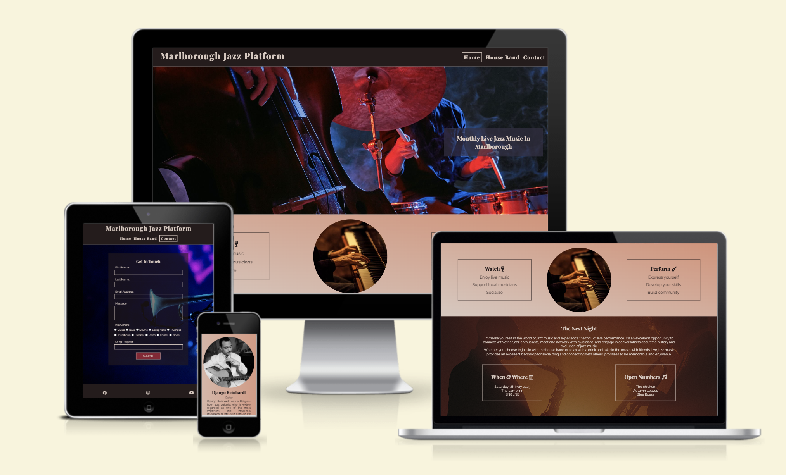

## Contents

* [**User Experience (UX)**](<#user-experience-ux>)
    * [Initial Discussion](<#initial-discussion>)
    * [User Stories](<#user-stories>)
        * [Client Goals](#client-goals)
        * [First Time Visitor Goals](<#first-time-visitor-goals>)
        * [Returning Visitor Goals](<#returning-visitor-goals>)
        * [Frequent Visitor Goals](<#frequent-visitor-goals>)
    * [Site Structure](<#site-structure>)
    * [Wireframes](<#wireframes>)
        * [Home Page: Desktop View](<#home-page-desktop-view>)
        * [House band Page: Desktop view](<#house-band-page-desktop-view>)
        * [Contact Page: Desktop View](<#contact-page-desktop-view>)
        * [Mobile View](<#mobile-view>)
* [**Design**](<#design>)
    * [Color Scheme](<#color-scheme>)
    * [Typography](<#typography>)
    * [Imagry](<#imagry>)
* [**Features**](#features)
    * [Existing Features](<#existing-features>)
        * [Navigation Bar](<#navigation-bar>)
        * [Landing Page - Hero Image](<#landing-page---hero-image>)
        * [Join Us Section](<#join-us-section>)
        * [The Next Night Section](<#the-next-night-section>)
        * [Footer](<#footer>)
        * [House Band](<#house-band>)
        * [Contact Form](<#contact-form>)
        * [Contact Form Sucess Page](<#contact-form-sucess-page>)
    * [Accesibility](<#accesibility>)
    * [Future Features](<#future-features>)
* [**Technologies Used**](<#technologies-used>)
    * [Languages](<#languages>)
* [**Testing**](<#testing>)
    * [Code Validation](<>)
        * [W3C HTML Checker](<#w3c-html-checker>)
        * [W3C CSS Checker](<#w3c-css-checker>)
        * [Lighthouse](<#lighthouse>)
    * [Responsiveness Test](<#responsiveness-test>)
    * [Browser Compatibility](<#browser-compatibility>)
    * [Peer Testing](<#peer-testing>)
* [**Bugs**](<#bugs>)
    * [Solved Bugs](<#solved-bugs>)
    * [Unsolved Bugs](<#unsolved-bugs>)
* [**Deployment**](<#deployment>)
* [**Credits**](<#credits>)
    * [Resources](<#resources>)
    * [Content](<#content>)
    * [Media](<#media>)
* [**Acknowledgements**](<#acknowledgements>)

## User Experience (UX)

### Initial Discussion
- The site's main goal is to make the night look inviting for both players and the general public while supplying information about the event and the house band. 
- It is aimed at fans of:
    - Jazz music 
    - Live improvisational music
    - Musical events

[Back to top](<#contents>)
### User Stories

#### Client Goals
- For the site to be responsive across different device types and screen sizes.
- To have good accessibility with readable fonts and good screen reader prompts.
- To clearly explain what the Marlborough Jazz Platform is about and how to come to the next event.
- To be able to get in contact with the organizers.

[Back to top](<#contents>)
#### First Time Visitor Goals
- Gain an understanding of what the jazz platform is.
- find out how to attend the next event.
- Find out information on the house band.
- Navigate the site easily.

[Back to top](<#contents>)
#### Returning Visitor Goals
- Find out what the open numbers for the upcoming night are.
- Find links to the social media accounts.

[Back to top](<#contents>)
#### Frequent Visitor Goals
- Message the organizers with song suggestions and other questions about the next event.

[Back to top](<#contents>)
### Site Structure

- The site consists of 4 pages:
    - Home
    - House Band
    - Contact
    - Thank you page
- All pages contain and are accessible via the navigation bar at the top of the page, except the thank you page which is displayed once you fill out the contact form.

[Back to top](<#contents>)
### Wireframes

#### Home Page: Desktop View
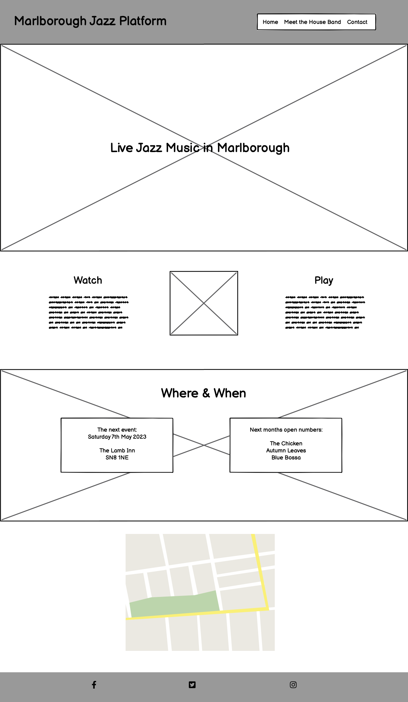
[Back to top](<#contents>)
#### House Band Page: Desktop View
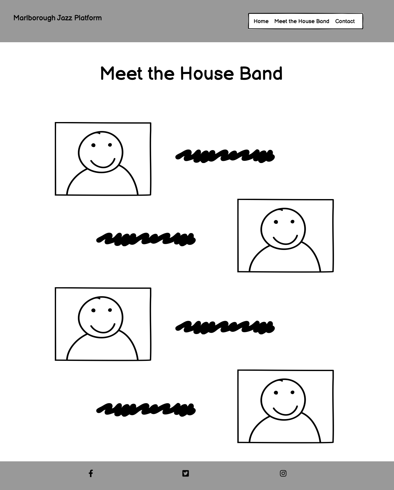
[Back to top](<#contents>)
#### Contact Page: Desktop View
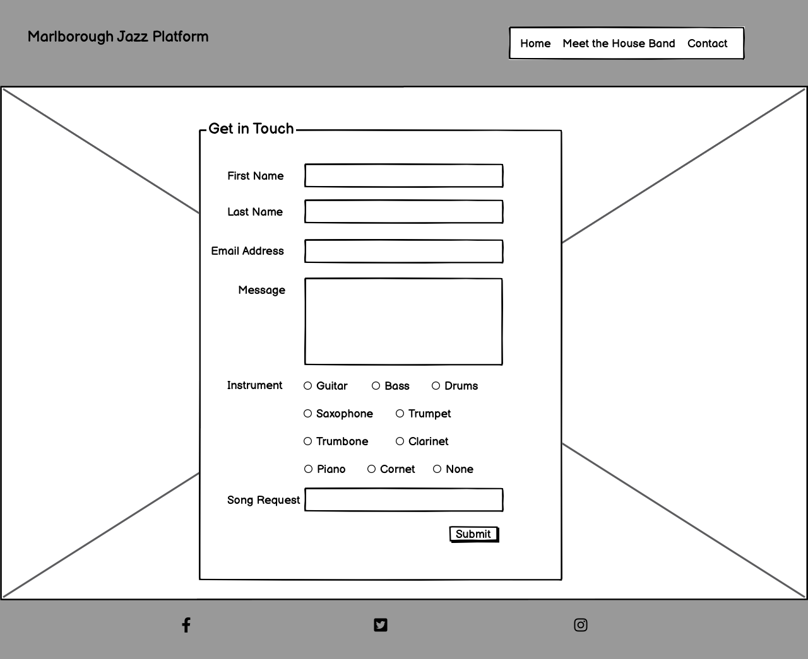
[Back to top](<#contents>)
#### Mobile View
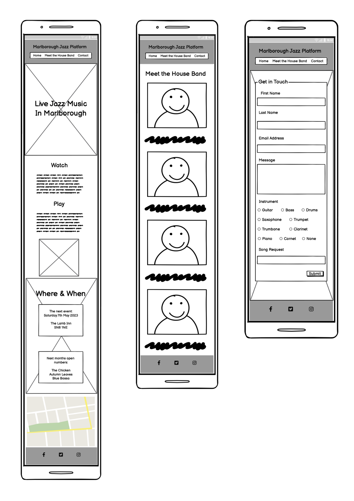
[Back to top](<#contents>)
## Design

### Color Scheme

To portray as much information as possible the colors of the site match the mood of one of the live events and blend in with the images that appear on the site.

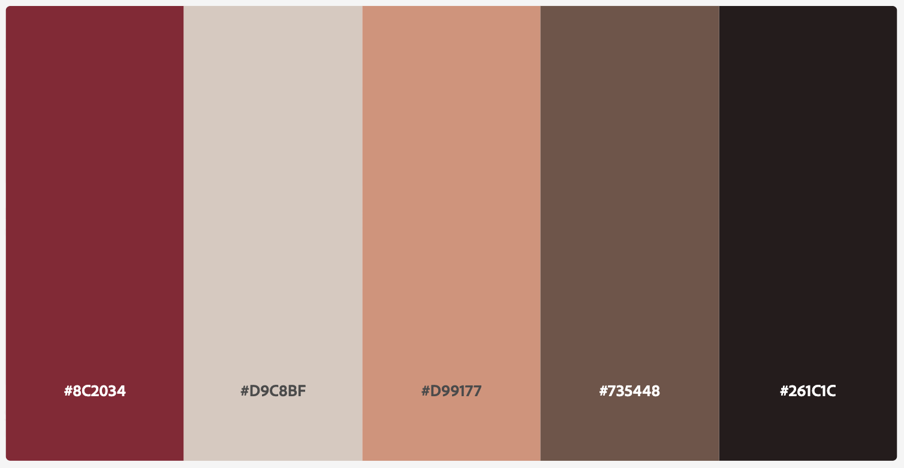

The [Adoble Color](https://www.color.adobe.com) website was used for the color palette. 

[Back to top](<#contents>)
### Typography

[Google Fonts](https://fonts.google.com) was used for the following fonts:
- Playfair Display
- Raleway

[Back to top](<#contents>)
### Imagry

- The live music images were all taken from stock image library in [Canva](https://www.canva.com)
- The band member images are all credited below.

[Back to top](<#contents>)
## Features
### Existing Features

#### Navigation Bar
- The navigation menu is fully responsive, with different views for:
    - Desktop
    - Tablet
    - Mobile
- The left side of the menu displays the sites logo that directs users back to the homepage.
The right side of the menu link to the other sites pages and drop below the logo for smaller screen sizes.
    - Home
    - House Band
    - Contact
- The menu makes navigating between the different pages in the site easy, avoiding use of the back button.
   
__Navigation menu: Desktop view__

__Navigation menu: Tablet & Mobile View__

[Back to top](<#contents>)
#### Landing Page - Hero Image
- The site starts with an image of a double bass player and a drummer performing with overlaying text explaining what the site is for.
- This section will grab the user's attention and give a feel for the atmosphere you can expect at the live event.

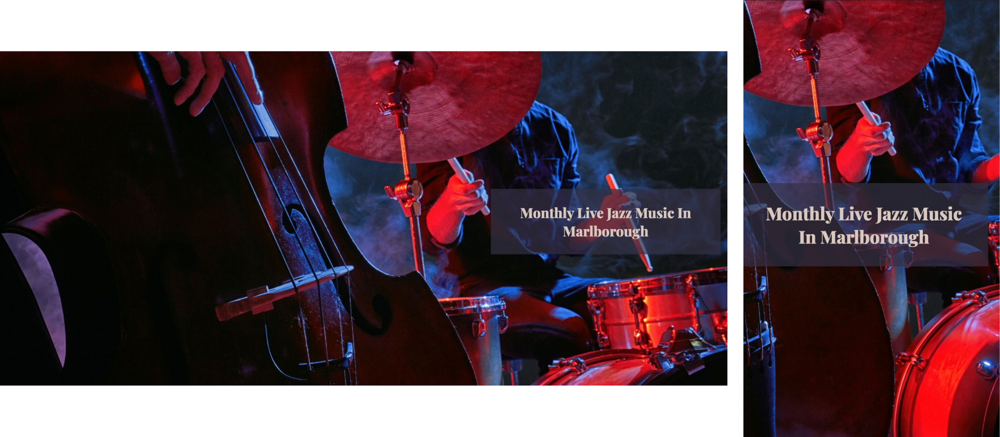

[Back to top](<#contents>)
#### Join Us Section
- The Join Us section outlines the reasons for coming to one of the jazz platform nights for both players and audience members.
- As well as encouraging users to come this gives them a better understanding of what to expect when they do come.
- The three columns in this section stack for smaller screens to increase usabillity.

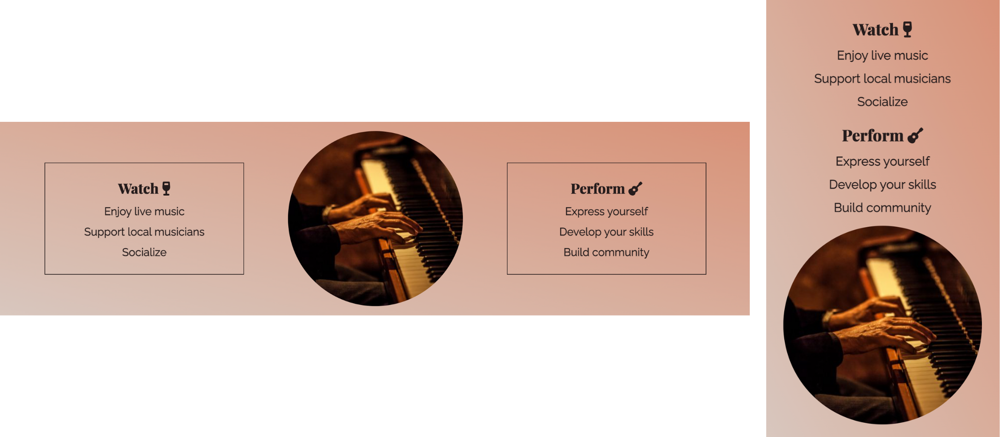

[Back to top](<#contents>)
#### The Next Night Section
- The Next Night Section gives more information on what to expect for one of the events. It outlines the time, date, and location of the event as well as the three open numbers that performers can join in with.
- The background image in this section continues to enhance the atmosphere that can be expected at one of the live events.
- The two collumns in this section stack for smaller screens to increase usabillity.
- The interactive map in this section will help people find the venue for the next event.

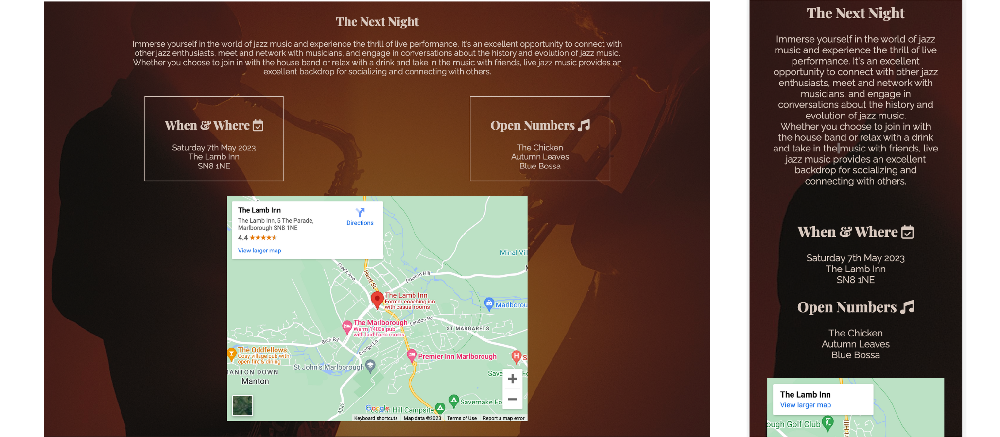
[Back to top](<#contents>)
#### Footer
- All the pages in the site have links to all the platform's social media accounts:
    - Facebook
    - Instagram
    - YouTube

[Back to top](<#contents>)
#### House Band
- The House Band page has a small bio at the top of the page introducing the band as a whole, this should build anticipation and excitement and encourage the viewer to read the individual bios of the members of the house band including:
    - Miles Davis: Trumpet
    - Django Reinhardt: Guitar
    - Herbie Hancock: Keys
    - Jaco Pastorious: Bass
    - Steve Gadd: Drums
- On a desktop and laptop this page will alternate between the image of the band member being on the left and the bio on the right to the image being on the left and the bio on the right. But, for smaller screen sizes all the information will stack to make it easier to read.
- The band members names are clickable links to their official webites or wikipedia pages that have an underline affect when hovered over. This is to build continuity between the navigation section of the site and the other clickable links.

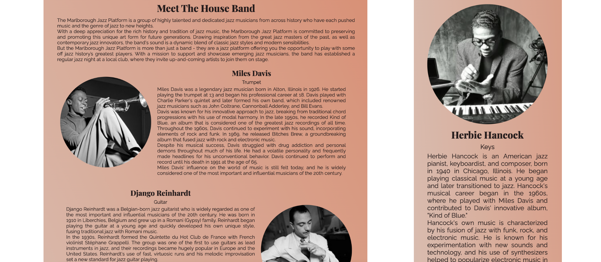

[Back to top](<#contents>)
#### Contact Form
- To open up communication with people interested in coming to one of the events there is a contact form asking:
    - First Name
    - Last Name
    - Email Address
    - Message
    - Instrument
    - Song Request
- The Name, email, message and instrument sections are mandatory but the song request isn't as not everyone sending a message will have a song request.
- The styling of the form is in keeping with the rest of the site to keep excitememt up and encourage attendance at the live event.

[Back to top](<#contents>)
#### Contact Form Sucess Page
- Once a user has successfully filled out the contact form they are redirected to this page letting them know they have been successful.

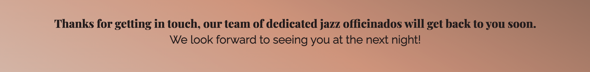

[Back to top](<#contents>)
### Accesibility

While designing and coding the site I have tried to be as conscious about the usability of the site for users of all types, including anyone using screen readers. This includes:
- Using semantic HTML
- Adding alt or aria attributes on images and logos for screen readers
- Ensuring there is good contrast between the background images/colors and the foreground text
- Making the menus accessible and indicating what page the site in currently displaying.

[Back to top](<#contents>)
### Future Features

- A video of the house band playing
- A shop section for merchandise

[Back to top](<#contents>)
## Technologies Used
### Languages
- HTML
- CSS

[Back to top](<#contents>)
## Testing

### Code Validation
Testing using the Google Chrome Dev Tools was used throughout the build of the site. Below you can see the results of the W3C HTML and CSS checkers for the finished site.

#### W3C HTML Checker

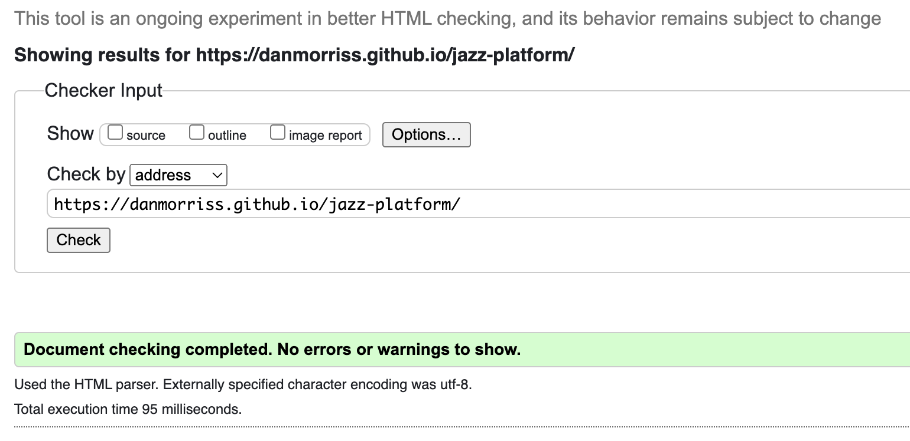

#### W3C CSS Checker

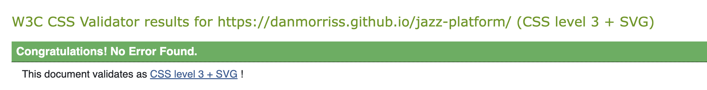

#### Lighthouse

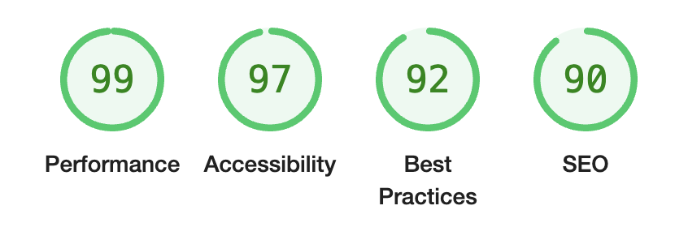

[Back to top](<#contents>)
### Responsiveness Test

Responsive testing was done using [Google Chrome Developer Tools](https://developer.chrome.com/docs/devtools/) and [Responsive Design Checker](https://www.responsivedesignchecker.com/) and real-world tests were carried out on a MacBook Pro 16-inch and iPhone 13.
- All navigation links on all pages work as expected
- All social links work on all pages work as expected
- Link to all external band member's sites work, opening up in a new tab
- All the images render correctly
- There is no whitespace around the page

#### Contact Form
- First Name needs to be filled in
- Last Name needs to be filled in
- Email address needs to be filled in including an @ symbol
- An Instrument option needed to be selected
- Once the form is filled in correctly you are successfully sent to the success page

[Back to top](<#contents>)
### Browser Compatibility

The site was tested on the following browsers without any issues. Functionality and responsiveness were consistent across browsers.
- Google Chrome
- Safari
- Firefox

[Back to top](<#contents>)
### Peer Testing

As well as testing myself the site was tested by three external users across a range of devices including smart-phones, tablets, and laptop computers. The site has also been sent for `peer-code-review` on the Code Institute Slack Channel. The following issues came up and have all be fixed.
- Spelling mistake in Open Numbers section
- Gramor mistake in The Next Night Section
- Outlined that an introduction to the house band members should be included
- Formatting change to band member bios to make reading easier

[Back to top](<#contents>)
## Bugs

### Solved Bugs
The following bugs were encountered during the build of the site:
- To get the navigation menu to stick to the left and right sides of the page I needed to put the page title and the links to the other pages in their own flexboxes.
- When using flexbox inside flexbox I had to experiment with using the correct alignment: `justify-content` or `align-items`.
- The contact form was not filling the whole screen, there was a white space at the bottom of the page, tis was fixed by adding a min-height of 80vp to the form-section div.
- The hero-image was too big and caused the load time to be slow so I replaced it with a smaller version.
- The background image for the contact form was not in the position I wanted so I used the `background-size: cover;` and `background-position: center;` to get it where I wanted.
- There was a white space to the right-hand side of the screen on mobile devices that was caused by the navigation flexbox section ovreflowing. I fixed this by adding `max-width: 100vw;` and reducing the padding inside a `@media` query.
- The comment box in the contact form was not transparent, this was fixed by targeting the textarea property in the CSS.
- The hover on the house band members names wasn't working. This was fixed by add in spesificty to the `:hover` CSS rule by using an `id` instead of a `class`.
- The `H1` on the navigation menu was too big for mobile devices, I used a `@media` query to reduce it for smaller screens.
- Once the contact form had been filled out it was not sending you to the success.html page. This was fixed by removing the method tag and setting the action tag to `success.html`.
- Hero image was displaying a non-sensical section for mobile devices so I moved the position.
- On a tablet the next event and join-us sections had lot's of unused space so I added an extra media query for smaller screens.
- Added a title to the map's iframe to increase lighthouse score.

[Back to top](<#contents>)
### Unsolved Bugs
There are no known unsolved bugs in the site.

[Back to top](<#contents>)
## Deployment

### To Deploy the project
GitHub pages was used to deploy the live site as follows:
1. Login to GitHub
2. Go to the repository [DanMorriss/jazz-platform](https://github.com/DanMorriss/jazz-platform)
3. Click the `Settings` tab
4. Click the `Pages` tab
5. Under the 'Build and Deployment' section select the `Deploy from a branch` from the dropdown menu
6. Select the `main` and `/root` dropdown menu options
7. Click `save` and after a few minutes the site was live 

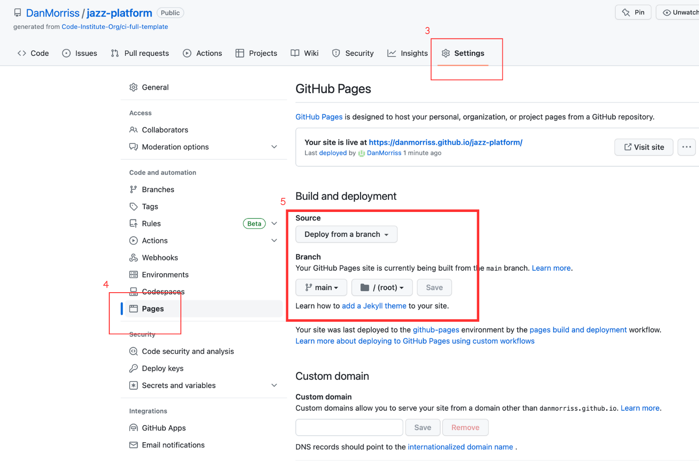

### To Fork the project
To make a copy of the GitHub Repository you can fork a copy to edit it without changing the root file. This can then be used to update the original repository. To fork take the following steps:
1. Login to GitHub
2. Go to the repository [DanMorriss/jazz-platform](https://github.com/DanMorriss/jazz-platform)
3. On the top right-hand side of the page click the `fork` button and save a copy of the original repository to your GitHub account.

### To Clone the project
To clone the project:
1. Click the `code` button  
2. Click the `local` tab
3. Under HTTPS click the clipboard icon to copy the URL
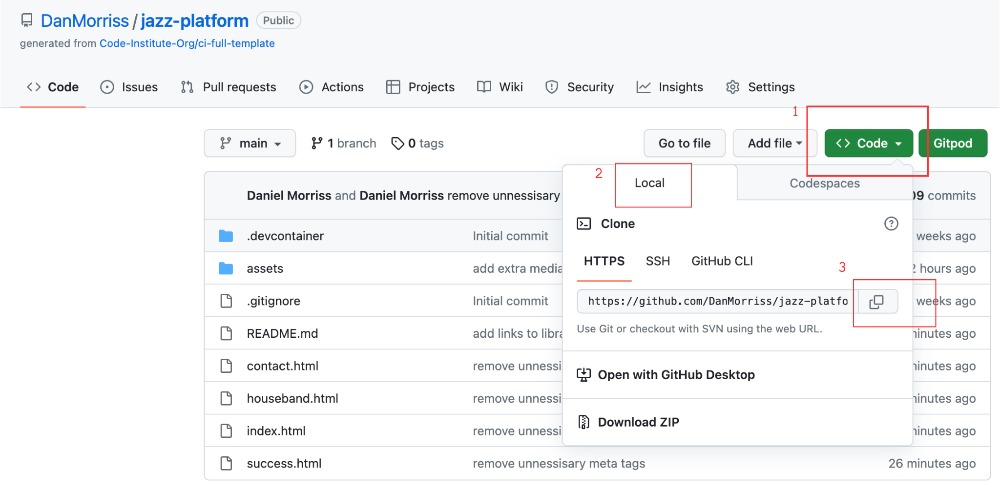
4. In your IDE of choice, open Git Bash
5. Change the current working directory to the location where you want the cloned directory to be made
6. Type `git clone` and then paste the URL copied from GitHub
7. Press enter and the local clone will be created

[Back to top](<#contents>)
## Credits

### Resources
- [Balsamiq](https://balsamiq.com/): used for the wireframes
- [Gitpod](https://www.gitpod.io/): used to write the code
- [Github](https://github.com/): used to store the code
- [Google Fonts](https://fonts.google.com/): for the fonts
- [Canva](https://www.canva.com/): for the images
- [Font Awesome](https://fontawesome.com/): for the icons
- [Google DevTools](https://developer.chrome.com/docs/devtools/): to debug, troubleshoot and test the site
- [Am I Responsive?](https://ui.dev/amiresponsive): For the display image across devices
- [Adobe Color](https://color.adobe.com/create/color-wheel): for the color pallet 
- [Web Aim](https://webaim.org/): To check the contract for accessibility
- [W3C HTML Validator](https://validator.w3.org/): to check the HTML
- [W3C Jigsaw CSS Validator](https://jigsaw.w3.org/css-validator/): to check the CSS
- [This blog article: 36 Perfect Font Pairings](https://www.creativebloq.com/typography/20-perfect-type-pairings-3132120) helped me pick matching fonts from Google Fonts
- [Kevin Powell's YouTube Channel](https://www.youtube.com/@KevinPowell) was used to learn more about flexbox
- [Stack Overflow]() for general troubleshooting

### Content
- [Chat GPT](https://openai.com/blog/chatgpt) was used for help writing the band bio's

[Back to top](<#contents>)
### Media
- The map is from [Google Maps](https://www.google.com/maps)
- All the images on the homepage came from [Canva](https://www.canva.com)'s stock library.
- The Miles Davis image came from [his website](https://www.milesdavis.com/)
- The Django Reinhardt image came from [this BAMF Style article](https://bamfstyle.com/2020/01/23/django-cream-suit/) 
- The Herbie Hancock image was taken by Norman Seeff for [this article](https://www.beachamjournal.com/journal/2021/04/herbie-hancock-is-81-years-ago-today.html)
- The Jaco Pastorius image was taken from [Google](http://t3.gstatic.com/licensed-image?q=tbn:ANd9GcT3QsdNDBt31FDzz5YKI6NU84TQ7Ro0GbHayD4C9-oyS7-gBHEnb2gFSFd79N84YfYvwP3ml715oRpuynE
)
- The Steve Gadd image was taken from [this article in Drummer World](https://www.drummerworld.com/drummers/Steve_Gadd.html).

[Back to top](<#contents>)
### Code Used
- Image zoom used on the hero-image was taken from Love Running Walkthrough.

[Back to top](<#contents>)
## Acknowledgements

- [Precious Ijege](https://github.com/precious-ijege), my Code Institute Mentor.
- Kent Yates, for taking the time to test and review my site and suggesting some bug fixes for my house band member's links.
- Selina Sheerin, for taking the time to test and review my site and point out some spelling and grammar errors.
- Helen Asherson, for taking the time to test and review my site.
- Abby Humphreys, for taking the time to respond to my peer code review request in slack.
- JarekB-dev's [Kitchen Makers](https://github.com/JarekB-dev/KitchenMakers) project as was used for inspiration 
- Kera Kudmore's [Bully Book Club](https://github.com/kera-cudmore/Bully-Book-Club) was used for inspiration on how to write a good reameme file
- EwanColquhoun's [Wasa Woods](https://github.com/EwanColquhoun/wawaswoods) was used as a reference for a good readme file

[Back to top](<#contents>)