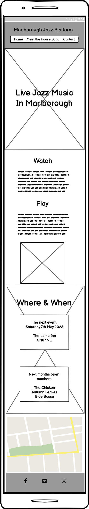
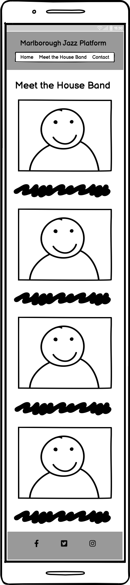
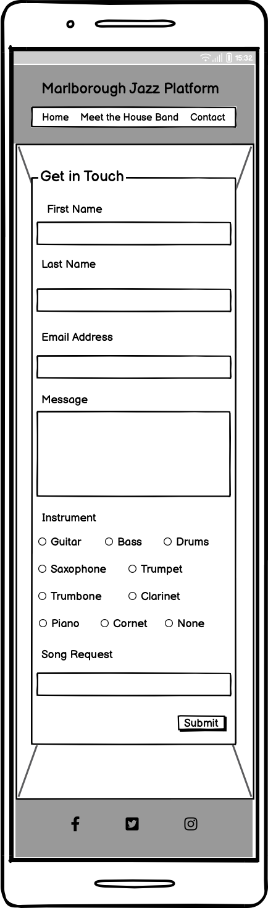
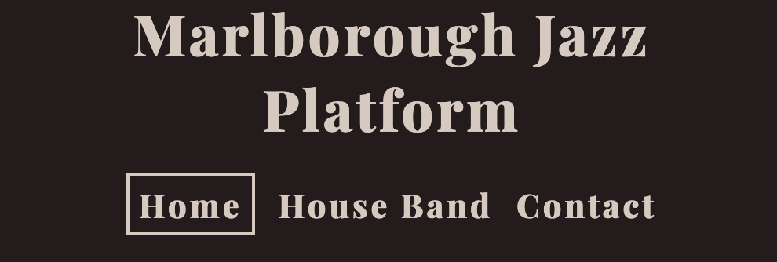
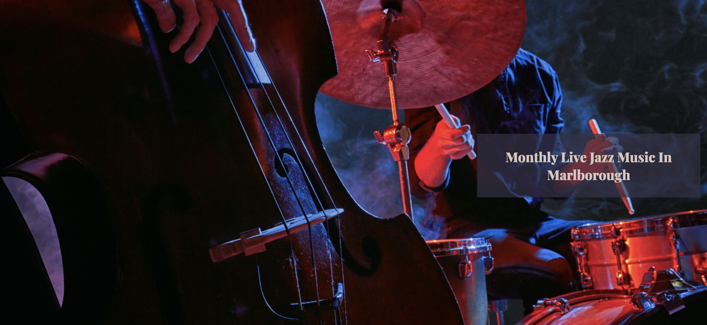
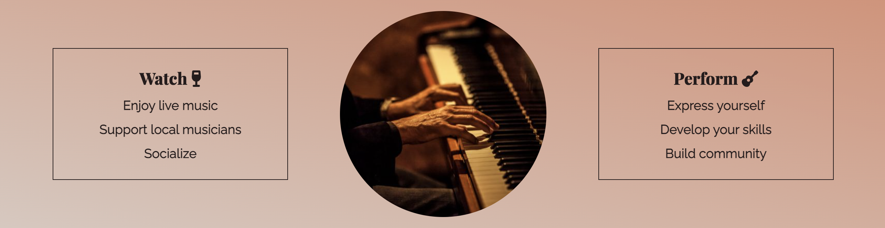
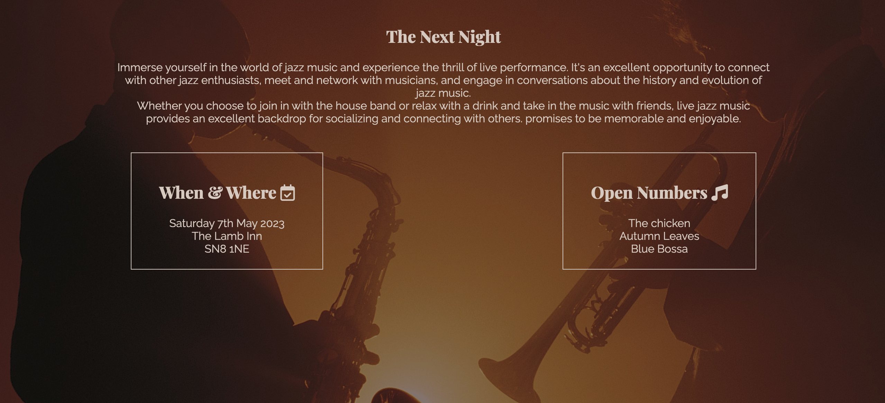
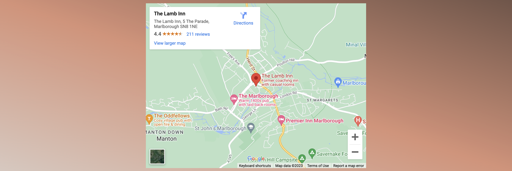
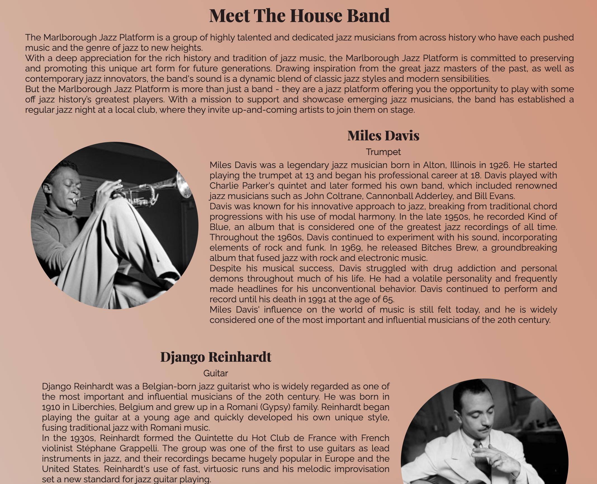
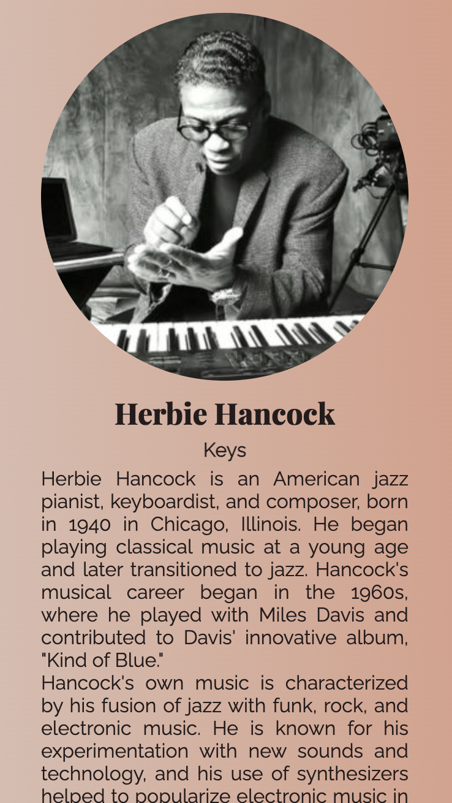

# Marlborough Jazz Platform

 A website for a fictional monthly jazz platform in Marlborough, Wiltshire.

### [Live Site](https://danmorriss.github.io/jazz-platform/)

### [Project Repository](https://github.com/DanMorriss/jazz-platform)

## User Experience (UX)

### Initial Discussion
- The site's main goal is to make the night look inviting for both players and the general public while supplying information about the event and the house band. 
- It is aimed at fans of:
    - Jazz music 
    - Live improvisational music
    - Musical events

### User Stories

#### Client Goals
- For the site to be responsive accross different device types and screen sizees
- To have good accesibility with readable fonts and good screen reader prompts
- To clearly explain what then Marlborough Jazz Platform is about and how to come to the next event
- To be able to get in contact with the organizers 

#### First Time Visitor Goals
- Gain an understanding of what the jazz platform is
- find out how to attend the next event
- Find out inforrmation on the house band
- Navigate the site easily

#### Returning Visitor Goals
- Find out what the open numbers for the upcoming night are
- Find links to the social media accounts

#### Frequent Visitor Goals
- Message the organizers with song suggests and other queestons about the next event

## Design

### Color Scheme

To portray as much information as possible the colours of the site match the mood of one of the live events and blend in with the images that appear on the site.

The [Adoble Color](https://www.color.adobe.com) website was used for the color palette. 

### Typography

Google fonts was used for the following fonts
- Playfair Display
- Raleway

### Imagry

- The live music images were all taken from stock image library in [Canva](https://www.canva.com)
- The band member images are all creditied below

### Wireframes

#### Home Page: Desktop View

#### Home Page: Mobile View

#### House Band Page: Desktop View

#### House Band Page: Mobile View

#### Contact Page: Desktop View

#### Contact Page: Mobile View

## Features
### Existing Features

- The site consists of 4 pages:
    - Home
    - House Band
    - Contact
    - Thank you page
- All pages contain and are accesible via the navigation bar at the top of the page, except the thank you page which is displayed once you fill out the contact form.

#### Navigation Bar
- The nagivation menu is fully responsive, with different views for:
    - Desktop
    - Tablet
    - Mobile
- The left side of the nemue displays the sites logo that directs users back to the homepage.
the right side of the menu link to the other sites pages and drop below the logo for smaller screen sizes.
    - Home
    - House Band
    - Contact
- The menu makes navigating between the different pages in the site easy, avouding use of the back button.
   
__Navigation menu: Desktop view__

__Navigation menu: Tablet view__

  
__Navigation menu: Mobile view__

#### Landing Page - Hero Image
- The site startis with an image of a double bass player and a drummer performing with overlaying text explaning what the site is for.
- This section will grab the users attention and give a feel for the atmosphere you can expect at the live event.

#### Join Us Section
- The Join us section outlines the reasons for coming to one of the jazz platform nights for both players and audience members.
- As well as encouraging users to come this gives them a better understanding of what to expect when they do come.
- The three collumns in this section stack for smaller screens to increase userbillity.

#### The Next night Section
- The Next Night Section gives more information on what to ecpect for one of the events. It outlines the time, date and location of the event as well as the 3 open numbers that performers can join in with.
- The background image in this section continues to enhance the antosphere that can be expected at one of the live events.
- The two collumns in this section stack for smaller screens to increase userbillity.

#### Map

- The interactive map in this section will help people find the venue for the next event.

#### Footer
- All the pages in the site have links to all the platforms social media accounts:
    - Facebook
    - Instagram
    - YouTube

#### House Band
- The house band page has an small bio at the top of the page instoducing the band as a whole, this should build anticipation and excitement for and encourage the viewer to read the individual bios of the members of the house band including:
    - Miles Davis: Trumpet
    - Django Reinhardt: Guitar
    - Herbie Hancock: Keys
    - Jaco Pastorious: Bass
    - Steve Gadd: Drums
- On a desktop and laptop this page will alternate between the image of the band member oeing on the left and the bio on the right to the image being on the left and the bio on the right. But, for smaller screen sizes sll the information will stack to make it easier to read.
- The band members names are clickable links to theri official webites or wikipedia pages that have an underlien affect when hovered over. This is to build continuity between the navigation section of the site.

__House Band: Desktop View__

__House Band: Mobile View__

#### Contact Form
- To open up communication with people interested in coming to one of the events there is a contact form asking:
    - First Name
    - Last Name
    - Email Address
    - Message
    - Instrument
    - Song Request
- The Name, email, message and instrument sections are mandatory but the song request isn't as not everyone sending a message will have a song request.
- The styling of the form is in keeping with the rest of the site to keep excitememt up and encourage attendance at the live event.

#### Contact Form Sucess Page
- Once a user has successfully filled out the contact form they are redirected to this page letting them know they have been successful.

### Accesibility

While designing and coding the site I have tried to be as consious about the usabillity of the site for users of all tipes, including screen readers. This includes:
- Using semantic HTML
- Adding alt or aria attributes on images and logos for screen readers
- Ensuring there is good contrast between the background images/colors and the forground text
- Making the menus accesible and indication what page the site in currently displaying

## Technologies Used

### Languages
- HTML
- CSS

### Libraries & Programs
- Balsamiq: used for the wireframes
- Gitpod: used to write the code
- Github: used to store the code
- Google fonts: for the fonts
- Canva: for the images
- Font Awesome: for the icons
- Google Developer Tools: to debug, troubleshoot and test the site
- Am I Responsive?: Dor the display image across devices
- Adobe Color: for the color pallet 
- Web Aim: To check the contract for accesibility
- W3C HTML checker: to check the HTML
- W3C CSS checker: to check the CSS

## Testing

Testing using the Google Chrome Dev Tools was used throught the build of the site. Below you can see the results of the W3C HTML and CSS checksrs for the finshed site.

### W3C HTML Checker

### W3C CSS Checker

## Bugs

### Solved Bugs
The following bugs were encountered during the build of the site:
- To get the navigation menu to stick to the left and right sides of the page I needed to put the page title and the links to the other pages in their own flexboxes.
- When using flexbox inside flexbox I had to experiment with using the correct alignment: `justfy-content` or `align-items`.
- The contact form was not filling the whole screen, there was a white space at the bottom of the page, tis was fixed by adding a min-height of 80vp to the form-section div.
- The hero-image was too big and causing the loadtime to be slow so I replaced it with a smaller version.
- The background image for the contact form was not in the position I wanted so I used the `background-size: cover;` and `background-position: center;` to get it where I wanted.
- There was a white space to the right hand side of the screen on mobile devices tahta was caused by the navigation flexbox section ovreflowing. I fixed this by adding `max-width: 100vw;` and reducing the pdding inside a `@media` query.
- The comment box in the contact form was not transparent, this was fixed by targeting the textare property in the CSS.
- The hover on the house band members names wasn't working. This was fixed by add in spesificty to the `:hover` CSS rule by using an `id` instead of a `class`.
- The `H1` on the navigation menu was too big for mobile devices, I used a `@media` query to reduce it for smaller screens.
- Once the contact form had been filled out it was not sending you to the success.html page. this was fixed by removing the method tag having the acion tag set to the success.html.
- To improve the ligthouse score I added more `meta` tags to the site.

### Unsolved Bugs
There are no known unsolved bugs in the site.
## Deployment

GitHub pages was used to deploy the live site as follows:
1. Login to GitHub
2. Go to the repositry [DanMorriss/jazz-platform](https://github.com/DanMorriss/jazz-platform)
3. Click the `Settings` tab
4. Click the `Pages` tab
5. Under the 'Build and Deployment' section select the `Deploy from a branch` from the dropdown menu
6. Select the `main` and `/root` dropdown menu options
7. Click `save` and after a few minutes the site was live 

